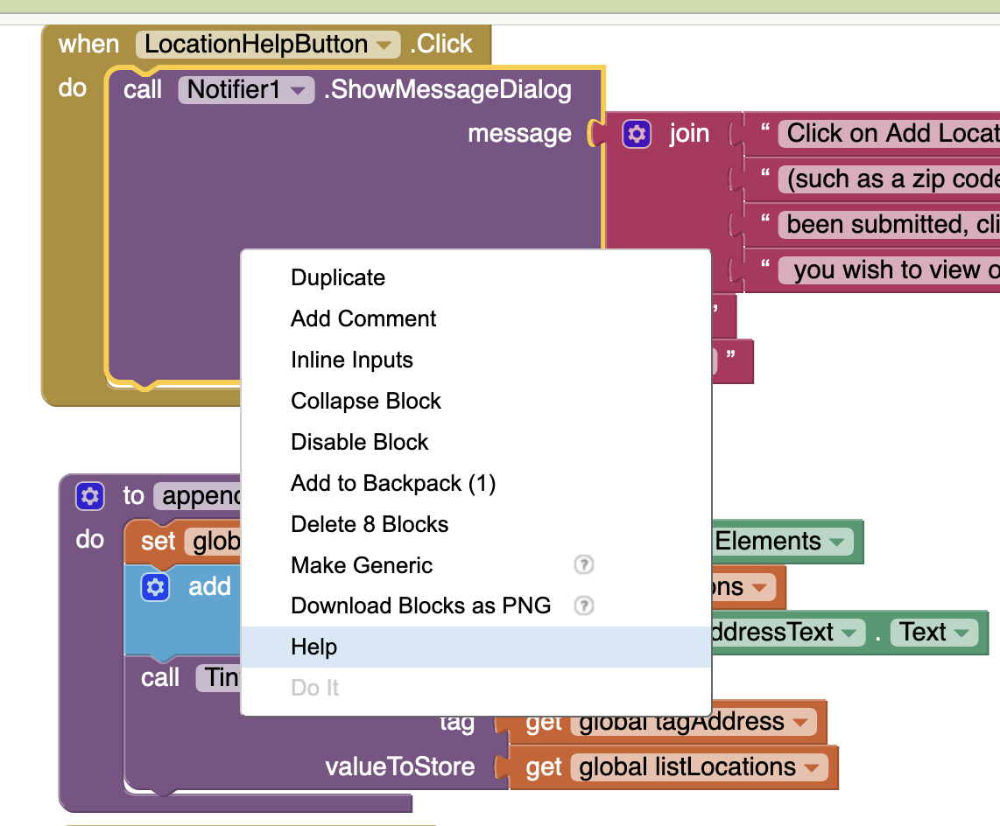

# WEEK 4 (WEEK OF JANUARY 29)
## LECTURE - DEBUGGING & ISSUE TRACKING

### DEBUGGING
[Bugs](https://en.wikipedia.org/wiki/Software_bug), [issues](https://en.wikipedia.org/wiki/Software_project_management#Issue), mistaken [assumptions](https://en.wikipedia.org/wiki/Tacit_assumption) and [unintended consequences](https://en.wikipedia.org/wiki/Unintended_consequences) are an inevitability of writing code. As fantastic as it would be to get everything right the first time, it's unlikely. And furthermore, it's probably unhelpful to think that bugs are not going to happen. You might be familiar with the various [programming memes](https://duckduckgo.com/?q=programmer+debugging+meme&t=ffab&iar=images&iax=images&ia=images) out there that reference the programmer's confusion in attempting to understand both non-working _and_ working code. These memes speak in a very real way to the faith most programmers (me included!) tend to have in the foolproof nature of their own code; I've definitely been guilty of saying "no, that would be impossible!" in the face of a result that very clearly indicates the opposite. :)  

 So, instead, I'd like you to recognize that bugs are _going_ to happen and that it's ok when they do. As long as you have a strategy, of course! This week's videos outline foundational strategies you can take when debugging, but it's your job to figure out how to apply them to your own context (i.e. your programming environment of choice). 

Identifying the source of bugs can be tricky, so having a thorough understanding of the development and debugging tools at your disposal is critical. While I can appreciate that it can feel like a lot of work to learn the ins and outs of debugging tools in your IDE of choice, doing so will pay off in the long run. Learn how to use your debugger, and especially those tools that are common to most, like [breakpoints](https://en.wikipedia.org/wiki/Breakpoint), conditional breakpoints, variable watches and navigation. Being comfortable with these tools will, most times, be the difference between a frustrating and unproductive debugging session, and one where a clear path forward is identified. 

<iframe width="560" height="315" src="https://youtube.com/embed/-jzOXtbntvw"></iframe>

### BUG TRACKING
Once you find a bug, what do you do with it? Do you drop everything and fix it right away? Do you make a mental note and say you'll come back later? While I'll concede that sometimes these two options might feel like the right direction, it's rarely the case. Much better is to record information about the bug in a bug tracking system that allows you  (or other developers) to correctly [prioritize](https://en.wikipedia.org/wiki/Prioritization) the bug.

Why is prioritization such a key aspect of bug tracking? Well, remember that we want to make small and meaningful commits at every opportunity. Rolling a bug fix into a larger commit is generally a bad idea. But dropping current progress to address a bug without considering the broader development context could be even worse. What if your fix changes the fundamental nature of some aspect of the codebase? Or what if the bug really isn't that big an issue, and can be deprioritized to be dealt with later? Focusing on low-priority bugs (especially those with complex fixes) reduces the amount of capacity you have to work on bugs that might make a major difference to your user-base. 

Well-documented and tracked bugs are bugs that can effectively be squashed. Don't neglect setting up a bug tracking process - even if you are a solo developer!

<iframe width="560" height="315" src="https://youtube.com/embed/mbk4WLZj4yg"></iframe>

## ACTIVITIES

### [REQUIRED] DEBUG GET THE GOLD
[Get the Gold](http://appinventor.mit.edu/explore/ai2/get-gold) is a [really not very fun...] `AI2` "game" that where the user is required to capture all the gold medallions on the screen by flinging a pirate ship sprite toward them. Of course, the gold medallions move based on a clock timer, so there is some "challenge". The version of [Get the Gold](https://github.com/nic-dgl104-winter-2024/guide-get-the-gold-debugging) we'll look at is modified from the tutorial and includes some additional features (both UI and gameplay). It also includes bugs. 

Your task is to identify the bugs and fix them. Some of these bugs will be fairly obvious and some of which will be harder to find. If you haven't seen it yet, I'll also suggest that you might find value in keeping a browser tab with the [`AI2` documentation](http://appinventor.mit.edu/explore/library) open (especially both the [blocks reference](http://ai2.appinventor.mit.edu/reference/blocks/) and the [component reference](http://ai2.appinventor.mit.edu/reference/components/)), so that you can reference what components are _supposed_ to do. You can also access documentation on specific blocks and components by right clicking and choosing "Help" from the context menu:

This activity probably works best in pairs, or in small groups, if you can find a partner or two to work with.

### [REQUIRED] READ BRIGHTSPACE RUBRICS CAREFULLY
Rubrics for both the Programming Practice article and the `AI2` project have been posted to Brightspace. In addition to the requirements already posted, the rubrics are how I will be evaluating your work. If you want to do well, it makes sense that you take a careful read of the rubrics to ensure you understand the project requirements in full.

Once you have read through the rubrics I would like you to post either a comment that demonstrates your understanding of the rubrics, or a question that will help you (and perhaps others) better understand the rubrics. It's important to note that despite my best efforts, there could be elements of the rubrics that are unclear. If everyone reads them carefully then we can hopefully fix any potential errors / misunderstandings before projects are submitted to be graded. This helps everyone - me included!

### [RECOMMENDED] WRITE A DRAFT OF YOUR PROGRAMMING PRACTICE ARTICLE
If you've taken the time to write a good outline, then you are already in a good position to write a draft of your article. For this first draft, concentrate on writing topic sentences that introduce each point you want to make in each paragraph, then use these to identify where code snippets and examples are going to be the most valuable to your article. 

Or feel free to take an alternative approach. Your draft can take many forms: It could be shorter than the final article, identifying only the critical statements that you can build on in second draft (my suggestion above); or, if you find writing easy, it could be much _longer_ than the target length of your article, and your work over the next week might involve cutting it down to a more manageable length. Whatever you do, getting some ideas down on paper will be a huge help to you over the next two weeks. 

If you need help with this you can reach out to me, or ask on Slack. The NIC Library also provides many [excellent resources](https://library.nic.bc.ca/writingsupport) to support your writing activities.

### [RECOMMENDED] BUILD AN MVP OF YOUR `AI2` PROJECT
With two weeks remaining, and given that you've built up some `AI2` experience, now would be a good time to put together a [minimum viable product](https://en.wikipedia.org/wiki/Minimum_viable_product) for your intended `AI2` project.

Once you have an MVP in-hand, the next best step is to test it out with a friend. If possible, build your MVP, install it on your device and share it with anyone and everyone you can. The more eyes and reactions you get on your MVP, the better your final product will be. Keep notes of what your testers have to say - and what they don't say! You can learn just as much from watching reactions as you can from listening to feedback.

### [RECOMMENDED] FOLLOW-UP QUESTIONS AND REFLECTIONS
1. Examine debugging tools in a preferred IDE or code editor of choice. What features are supported? Take a careful look through the debugger UI and identify available features. 
2. How many of the debugging features available are you already familiar with? Create a table that compares and contrasts your familiarity, or lack of familiarity, with the available features. 
3. When has debugging been particularly challenging? Consider a project that you've worked on in the past where a bug was particularly difficult to solve. What techniques did you use? How has what you've recently learned going to help you debugging similar issues the future? 

## OPTIONAL CONTENT
- [MIT 6.005 Debugging](https://ocw.mit.edu/ans7870/6/6.005/s16/classes/11-debugging/)
- [Debugging in VS Code](https://code.visualstudio.com/Docs/editor/debugging)
- [Debug JavaScript in Chrome](https://developer.chrome.com/docs/devtools/javascript/)
- [Firefox JavaScript Debugger](https://firefox-source-docs.mozilla.org/devtools-user/debugger/index.html)
