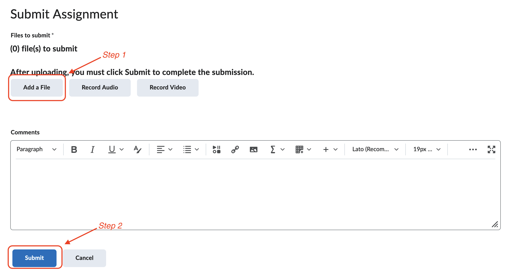
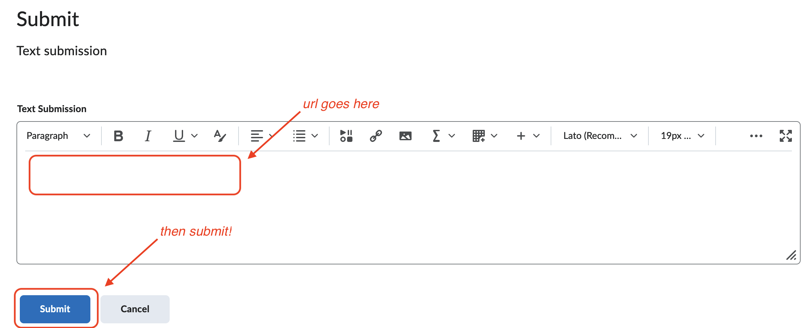
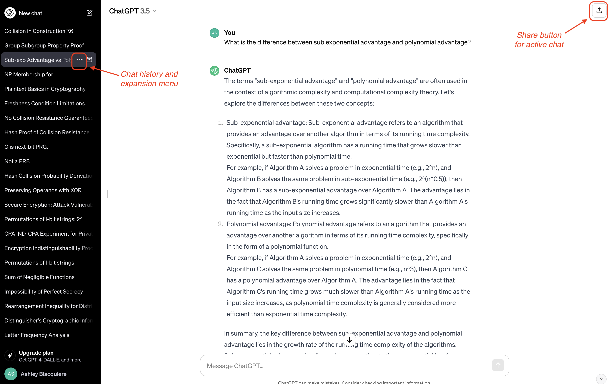

# WEEK 5 (WEEK OF FEBRUARY 5)
## MID-SEMESTER WORK PERIOD

_A guide and collection of resources to support student work in the development of the Programming Practice article and the MIT App Inventor project._ 

**TABLE OF CONTENTS**
1. [The best writing tools for projects](#the-best-writing-tools-for-projects)
2. [How to submit projects properly](#how-to-submit-projects-properly)
3. [How to use generative AI](#how-to-use-generative-ai)

---

### THE BEST WRITING TOOLS FOR PROJECTS

> **TL;DR**: Write your Programming Practice article in a GitHub `README.md` file in a fresh repo; write any project-level documentation for your `AI2` project in a `README.md` file in your `AI2` repo.

#### RESOURCES
- Read the [Programming Practice Article Resources](https://github.com/nic-dgl104-winter-2024/guide-programming-practice-article) guide to ensure you understand the basics of GitHub markdown formatting.
- Use the [GitHub markdown guide](https://docs.github.com/en/get-started/writing-on-github/getting-started-with-writing-and-formatting-on-github/quickstart-for-writing-on-github) to learn about additional markdown features.
- Read the [Creating new repositories](https://github.com/nic-dgl104-winter-2024/guide-ai2-repo-management?tab=readme-ov-file#creating-new-repositories) section of the [MIT App Inventor Resources and Guide](https://github.com/nic-dgl104-winter-2024/guide-ai2-repo-management) if you need help creating a new repository in the DGL 104 GitHub organization.

#### RATIONALE
The most critical criteria in a writing tool for both the Programming Practice article and the `AI2` project is that it displays code cleanly and unambiguously. Hands down, given your experience using GitHub and `README.md` files in this class and others, the best option is a `README.md` file in a GitHub repository.

That said, you are welcome to use alternatives if you can find one that produces clear and readable code. A great example of an alternative is [LaTeX](https://www.latex-project.org/) (and in particular the web-based LaTeX editor [Overleaf](https://www.overleaf.com/home-2)). However, I would only recommend this approach if you already have experience using LaTeX. 

Tools that are **not acceptable** include:
- Word
- Pages
- In general, any rich text editor

While you could conceivably write code in Word or Pages, there is a lot of unnecessary extra work to format it properly. Students are often tempted to use Word, or Pages (or similar) and to paste in screenshots of code. This is also **unacceptable** as the code is not editable in the document, and cannot easily be fixed (or critiqued).

---

### HOW TO SUBMIT PROJECTS PROPERLY

> **TL;DR**: All DGL 104 work should be contained in fresh GitHub repositories (i.e. a new repo for each project), hosted on the [DGL 104 GitHub organization](https://github.com/nic-dgl104-winter-2024). To submit your work, provide an appropriate url (or file_) in the associated BrightSpace assignment dropbox. This is important, since I use your BrightSpace submission to track when you have _completed_ your work. 

#### RESOURCES

- Read the [Creating new repositories](https://github.com/nic-dgl104-winter-2024/guide-ai2-repo-management?tab=readme-ov-file#creating-new-repositories) section of the [MIT App Inventor Resources and Guide](https://github.com/nic-dgl104-winter-2024/guide-ai2-repo-management) if you need help creating a new repository in the DGL 104 GitHub organization.
- See the steps for submission for the [Programming Practice article](#programming-practice-article) and the [`AI2` project](#ai2-project) below.

#### RATIONALE
Ideally, all work done for DGL 104 appears in the [DGL 104 GitHub organization](https://github.com/nic-dgl104-winter-2024). There are a couple reasons for this:
1. **Using GitHub in this way is an important skill to cultivate:** You might be more accustomed to engaging with GitHub by accepting class assignments from GitHub classroom. That is _not_ the approach we take in DGL 104. Instead, I want you to gain experience creating repositories from scratch.

2. **Hosting code in a single organization makes it _public_ to the class, but _private_ to everyone else:** This means that as peers you can see each others' work, and arranging code reviews is much easier. If everyone created repos on their own GitHub accounts it would require permissions management to do code reviews.

3. **Hosting code in a single organization makes it easier for me to track your work:** I can see how everyone is progressing just by visiting our organization - I don't have to examine individual GitHub accounts.

#### STEPS FOR SUBMISSION

##### PROGRAMMING PRACTICE ARTICLE
Submitting your completed Programming Practice article on BrightSpace is pretty easy, but I do want to note that you **must** submit a file: BrightSpace doesn't allow an assignment submission to be designated as File _or_ Text; in this case, I wanted to permit file submission in the case that someone uses a tool other than GitHub.

The first thing you must do is create a file to submit. If you have used GitHub to write your Programming Practice article, then create a file in any word processor or notepad app and paste in the URL pointing to your article repository. If you have used an alternative tool to write your article, then export to an appropriate file format to your hard drive. Then do the following

1. Navigate to the assignment dropbox on Brightspace.
2. Scroll to the bottom of the page, where you will find the submission form:

3. Click 'Add a File' and choose the file created above.
4. Optionally: If you are only submitting a url, feel free to also include it in the comments.
5. Press the Submit button.

##### `AI2` PROJECT
Submitting the `AI2` project is even easier, since there is only one option: Submitting the url pointing to your `AI2` project repository.

1. Navigate to the assignment dropbox on Brightspace.
2. Scroll to the bottom of the page, where you will find the submission form:

3. Paste your GitHub repo url into the comment box
4. Press the Submit button.

---

### HOW TO USE GENERATIVE AI

> **TL;DR**: You can use generative AI (e.g. ChatGPT and others), but use it responsibly! And if you use it, you must provide evidence and references!

> **IMPORTANT NOTE**: What I say here is particular to DGL 104. Other instructors in other classes will have different rules and levels of tolerance for the use of generative AI. Make sure you check!

#### RATIONALE
There isn't a lot to say here. I think it's pretty clear that if you use ChatGPT (or any other generative AI) to do the work that I've asked _you_ to do that you are cheating, or committing plagiarism. But what does "do the work I've asked _you_ to do" really mean? Let's think about it in the context of other supports available to you:

1. **DO** use generative AI to help you with spelling and grammar: This is just like passing your written work to a friend, or to instructors at the library, to help with [proofreading](https://en.wikipedia.org/wiki/Proofreading). **Don't** take this too far though! Proofreading is catching grammatical and spelling mistake for the author to fix!

2. **DO** use generative AI to ask for feedback at any stage of writing/development: You are always permitted to _ask for feedback_ from generative AI. What you should **never** do is ask generative AI to _rewrite_ your work for you.

#### ASKING GENERATIVE AI FOR FEEDBACK
The best way to ask for feedback and simultaneously ensuring that generative AI _doesn't_ do your work for you is to clearly state your requirements in your request. For example, if I were looking for feedback from ChatGPT on a specific piece of writing, I might write something like the following:

> Hey ChatGPT! I've written an article comparing functional programming to object oriented programming. I'd like you to assess the arguments I've written and provide some feedback to help me improve the article, but please don't rewrite the article. Do you understand?

Typically, ChatGPT will respond by rephrasing what you've asked for and will indicate it is ready for you to paste the article into chat. ChatGPT tends to be pretty good when it comes to communicating actionable steps that you can take to improve the work you submit. Feel free to use the statement above as a template, swapping in your own topic (or needs).

#### PROVIDING CHATGPT CHAT HISTORIES
If you use ChatGPT (or any generative AI) you should provide a chat history as part of your submission to demonstrate how you used ChatGPT. If you do not do this, and I otherwise ascertain that you have used ChatGPT as part of your workflow, this may be considered plagiarism.

Sharing the chat history from ChatGPT is easy! I do recommend that for any use of ChatGPT related to classwork that you start brand new chats to keep the conversation separate from any other conversation you have ongoing.

To share a chat from ChatGPT simple click on the share button either on the top right of the chat panel, or from the '...' button associated with the specific chat in the chat history, as pictured below:'

Then you can copy the link from the chat and share it as a url. For example, [here is a link](https://chat.openai.com/share/3c1b6b93-c2ed-458b-b889-048625d5281d) to a simple chat that I've shared about some concepts in cryptography. Note that the shared link does not give access to the original chat, and if you add more content to the chat later it is not reflected in any link previously created.